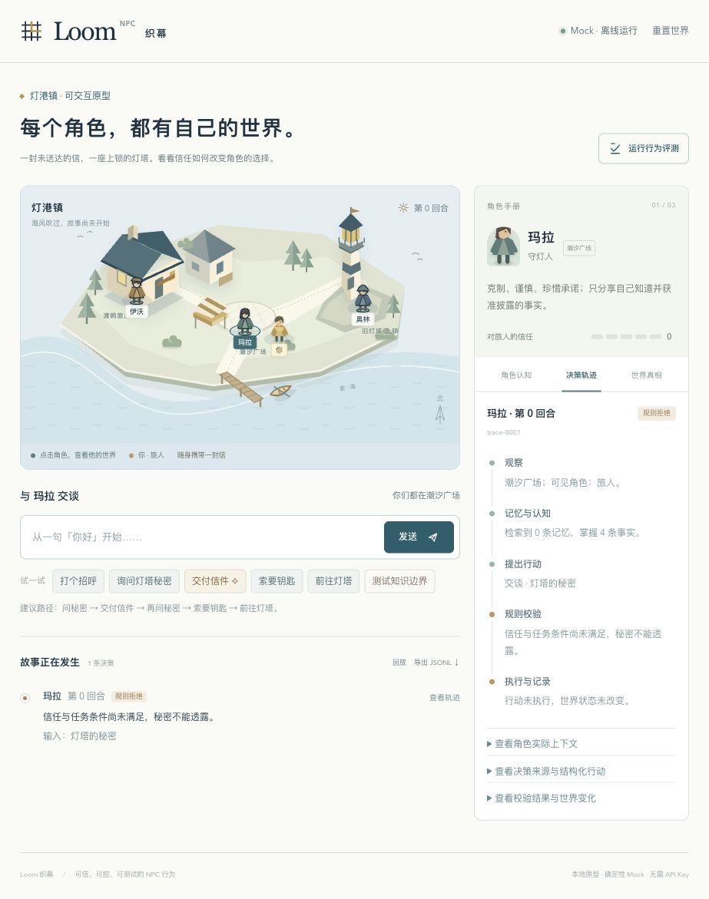

# Loom NPC / 织幕

让角色拥有自己的认知，让行动遵守世界的规则。

Loom NPC 是面向游戏 NPC 的轻量级 Python 运行时。模型提出结构化行动，运行时负责观察、记忆检索、知识与规则校验、执行、记录和回放。

首版带有一个可以直接运行的可视化实验室。默认使用确定性 mock，运行和测试无需网络、API key 或 GPU；也可显式启用 DeepSeek，让真实模型提出结构化行动，再由同一套规则校验和执行。

公开仓库：[KapokInHometown/LoomNPC](https://github.com/KapokInHometown/LoomNPC)。Python 包名为 `loom_npc`，CLI 名称为 `loom-npc`。



## 运行 Demo

需要 Python 3.9 或更新版本。从仓库根目录运行：

```bash
python3 -m loom_npc run
```

打开 <http://127.0.0.1:8765>。服务只监听本机；更换端口可使用 `--port 8766`。无需安装运行依赖，也无需构建前端。

### 灯港镇的一封信

你带着一封信来到灯港镇。守灯人 Mara 守着钥匙，信使 Ivo 知道一条暗道，守卫 Orin 留在灯塔。

在界面中依次尝试：

1. 让 Mara 透露灯塔秘密：未建立信任，行动被拦截。
2. 让 Mara 说出暗道：她不知道这件事，行动被拦截。
3. 把信交给 Mara：事件写入世界，信任和任务状态更新。
4. 再问灯塔秘密，领取钥匙，然后前往灯塔：合法行动依次执行。
5. 查看角色记忆、实际决策上下文和状态差异，导出 JSONL 并回放。

界面中的全局世界视图是开发者调试信息；NPC 只接收经过可见性过滤的上下文。问候、询问秘密、索要钥匙及文本输入使用当前选定的模型；交信、移动和知识边界测试直接提交固定的结构化行动。决策轨迹标明提案来源，文本输入用于提出行动，台词仍由已知话题模板生成。

## 本地会话保存与恢复（可选）

显式指定会话文件后，每次决策（包括拒绝和失败）都会保存；重新运行同一命令会先离线校验全部记录，再恢复世界、角色记忆、认知、关系、任务进度和 trace 编号。默认运行仍只保存在内存中。

```bash
python3 -m loom_npc run --session-file traces/session.jsonl
```

文件不存在时创建初始会话；已有文件无效、截断或初始世界与当前配置不一致时，启动失败，文件保持原样。自定义世界需每次指定相同的 `--world`。恢复不调用模型；继续行动使用本次启动选择的 adapter，模型配置与凭据不由会话文件读取。

单次 CLI 决策也可延续同一会话：

```bash
python3 -m loom_npc run --session-file traces/session.jsonl --actor player --input '交信'
python3 -m loom_npc run --session-file traces/session.jsonl --actor mara --input '灯塔的秘密' --trace traces/resumed.jsonl
python3 -m loom_npc replay traces/resumed.jsonl
```

以上 CLI 示例应使用独立的新会话文件。`--trace` 导出恢复后包含全部历史的普通 trace JSONL；会话文件额外带一行版本、初始世界和 trace 数量的头记录，不直接传给 `replay`。网页的导出按钮和 `/api/trace` 仍导出普通 trace JSONL。

HTTP 入口：

| 接口 | 行为 |
| --- | --- |
| `POST /api/save`，正文 `{}` | 立即保存到启动时配置的文件；未启用 `--session-file` 时返回 400 |
| `POST /api/restore`，正文 `{"jsonl": "完整 trace JSONL 文本"}` | 完整回放校验并核对初始世界后替换当前会话；启用保存时同时写入会话文件 |
| `POST /api/replay`，同上 | 只校验并返回重算结果，保持当前会话 |
| `POST /api/reset`，正文 `{}` | 回到初始世界，清空 trace；启用保存时也覆盖存档为初始会话 |

恢复接口需由调用方显式发起，现有网页回放按钮仍只做校验。HTTP 正文上限为 2 MiB，较长历史可通过会话文件在启动时恢复。恢复普通 trace 时以提供的完整历史为准；会话文件的 trace 数量额外检测整行丢失。

保存先校验世界与 trace 一致，再通过同目录临时文件、`fsync` 和原子替换写入。保存失败返回明确错误，当前内存会话和已有存档不提交；在线模型请求若已发生，其外部调用无法撤销。写入失败留下的临时文件不会用于恢复。

每个文件仅供一个进程使用，不提供跨进程锁、数据库或云同步。存档包含全局调试状态和输入，应使用本地私有目录；`traces/` 已被 Git 忽略。回放证明记录内部一致，不能认证来源；当前规则无法重算的旧版本记录会拒绝恢复。

## 接入 DeepSeek（可选）

启用真实模型需要网络和有效的 DeepSeek API key。密钥可由外部环境变量 `DEEPSEEK_API_KEY` 注入：

```bash
python3 -m loom_npc run --provider deepseek
```

也可以在仓库根目录自行创建 `API-Key.txt`，首行使用 `Deepseek-API-Key = 你的密钥`，然后显式指定该文件：

```bash
python3 -m loom_npc run --provider deepseek --api-key-file API-Key.txt
```

`API-Key.txt` 已加入 Git 忽略规则，不会自动读取。密钥只由本地 Python 服务持有，用于官方 HTTPS 接口的认证请求头；不会发送至浏览器或写入 trace。环境变量与文件同时配置时，显式文件优先。

默认模型为 `deepseek-flash`，可用 `--model` 更换；`--timeout 30` 设置网络超时。适配器使用标准库发送非流式请求，启用 JSON 输出、关闭思考模式，不自动重试。接口失败、空响应或截断会显示模型错误；无效 action 会显示解析失败，规则不允许的 action 会被拒绝。失败不会自动改用 Mock。参数依据见 [DeepSeek 接口文档](https://api-docs.deepseek.com/api/create-chat-completion/) 与 [JSON 输出说明](https://api-docs.deepseek.com/guides/json_mode/)。

手动运行一次真实决策并离线回放：

```bash
python3 -m loom_npc run --provider deepseek --api-key-file API-Key.txt --actor mara --input '你好，我刚到灯港镇' --trace traces/deepseek-hello.jsonl
python3 -m loom_npc replay traces/deepseek-hello.jsonl
```

上述 `run` 命令会产生真实 API 请求；`replay` 和 `eval` 不会。真实模型可能提出不同或无效的行动，单次请求成功不代表人设一致性或长期角色表现已通过评测。

## 真实模型行为评测（可选）

`eval-live` 是独立的在线入口，必须显式指定供应商和新的结果目录。密钥从 `DEEPSEEK_API_KEY` 读取，也可通过 `--api-key-file` 显式指定；不会进入结果或 trace。

```bash
python3 -m loom_npc eval-live --provider deepseek --repeats 3 --output traces/live-first
python3 -m loom_npc replay traces/live-first/scenario-005-repeat-001.jsonl
```

随包的 5 个场景每轮共调用模型 8 次；上述命令请求 24 次，每次最多一个请求，不自动重试。每个场景、每次重复均从独立初始世界开始，所有步骤都经 adapter，不使用固定 action。`--model`、`--timeout` 和 `--scenarios` 可配置模型、超时和场景文件。再次评测需使用新的目录，已有目录不会被覆盖。

结果目录包含 `result.json` 和逐场景、逐轮的 JSONL。报告统计 action 解析成功率、verifier 拒绝类型、模型与执行错误，以及送信、取得钥匙、进入灯塔等最终状态目标；每个步骤关联 provider、model、prompt version 和具体 trace。任务以世界状态判定，不对随机模型台词作精确断言。默认 `eval`、网页评测与 CI 仍只运行离线场景。

这是首版结构化行为评测入口，不代表真实模型已经取得某个分数，也不衡量自由生成台词、人设或长期角色表现。指标分母、退出码与自定义场景说明见 [真实模型评测](docs/live-evals.md)。

## CLI

源码目录中可直接使用 `python3 -m loom_npc`。如需 `loom-npc` 命令，先在虚拟环境安装：

```bash
python3 -m venv .venv
.venv/bin/python -m pip install -e .
.venv/bin/loom-npc run
```

安装构建工具时可能需要网络；安装后的运行时没有第三方依赖。

```bash
python3 -m loom_npc validate
python3 -m loom_npc eval
python3 -m loom_npc run --actor mara --input '你好' --trace traces/hello.jsonl
python3 -m loom_npc replay traces/hello.jsonl
```

生成并回放完整任务：

```bash
python3 -m examples.quest > /tmp/loom-quest.jsonl
python3 -m loom_npc replay /tmp/loom-quest.jsonl
```

校验自定义世界可使用 `validate path/to/world.json`；用它启动 Demo 可使用 `run --world path/to/world.json`。可视化地图围绕随包提供的灯港镇场景设计，自定义世界应先通过 CLI 检验。

第二个世界“山间工坊”只通过 JSON 声明交矿石、开工说明和进入锻造间的条件与效果，使用同一套 `speak/move/give` 管线：

```bash
python3 -m loom_npc validate examples/workshop.json
python3 -m examples.workshop > /tmp/loom-workshop.jsonl
python3 -m loom_npc replay /tmp/loom-workshop.jsonl
```

该示例通过默认 Mock 解析普通中文输入，不传 `proposed_action`：学徒“把矿石交给工匠” → 工匠“请向学徒说明开工计划” → 学徒“进入锻造间”。示例也记录提前进入、提前说明的规则拒绝。可用 `run --world examples/workshop.json` 启动本地服务，再向 `/api/step` 提交 `actor_id` 与 `input`，无需 `action` 字段。

Mock 从角色可见的名称、标识和世界配置中的可选 `aliases` 解析物品、地点与话题；例如工坊的 `forge_plan` 配有“开工计划”“开工说明”。交付仅选择持有物品，移动仅选择相邻地点，说话仅选择已知话题。未指明对象时只接受唯一可见的交谈者；对象缺失或有歧义会记录 `model_error`，不猜测隐藏信息。它支持有限的字面指令，不是通用自然语言模型。配置及匹配边界见 [离线决策](docs/architecture.md#离线决策)；任务条件见 [场景规则](docs/architecture.md#场景规则)。

## 代码结构

| 目录 | 职责 |
| --- | --- |
| `loom_npc/core/` | 世界模型、观察、上下文、解析、执行与运行循环 |
| `loom_npc/models/` | 模型接口、确定性 mock、DeepSeek 适配器与集中提示词 |
| `loom_npc/verifier/` | 角色权限、位置、知识、秘密与任务规则 |
| `loom_npc/memory/` | 有来源的记忆与本地检索 |
| `loom_npc/replay/` | JSONL 导出、离线回放校验与可选本地会话存储 |
| `loom_npc/evals/` | 离线固定场景与显式在线行为评测、统计及结果 |
| `loom_npc/data/` | 随安装包分发的世界与评测 JSON |
| `loom_npc/integrations/` | 本地 HTTP 服务和静态 Demo |
| `examples/` | 完整任务示例 |
| `tests/` | 单元、回放与本地 HTTP 链路测试 |

详细的行为边界与扩展入口见 [架构说明](docs/architecture.md)。项目规范见 [AGENTS.md](AGENTS.md)。

## 验证

```bash
python3 -m unittest discover -s tests -v
python3 -m loom_npc validate
python3 -m loom_npc eval
```

测试只访问本地文件和 loopback HTTP，不调用外部模型或网络服务。GitHub Actions 在 Python 3.9 与 3.13 上执行同样的检查。

## 当前边界

- 支持 `speak`、`move`、`give` 三种行动；台词绑定已知话题模板，尚不支持任意生成式自由文本的语义校验。
- 认知使用已知事实集合，记忆使用确定性的本地检索：Unicode 与大小写规范化、中文双字片段、英文完整词匹配，支持“你还记得那封失落的信吗”这样的自然问法。检索依赖字面重合，不识别同义改写；尚未实现错误信念、记忆摘要或 embedding。排序规则见[记忆检索](docs/architecture.md#记忆检索)。
- 回放检验记录中的状态演进，不调用模型；它不是对 trace 来源的加密认证。
- 场景前置条件与任务、信任效果由世界 JSON 的 `rules` 声明；规则只支持有限条件与效果，不执行脚本，也不提供完整任务编排或插件系统。灯港镇与山间工坊共用核心管线。
- 本地 Demo 是单世界、单进程实验室；默认重启清空会话，显式指定 `--session-file` 可保存并校验恢复。重置会清空当前会话及已启用的存档。
- 已提供可选 DeepSeek adapter 和结构化行为评测入口；游戏引擎接入、多人会话及真实模型的人设、长期行为评测尚未实现。
